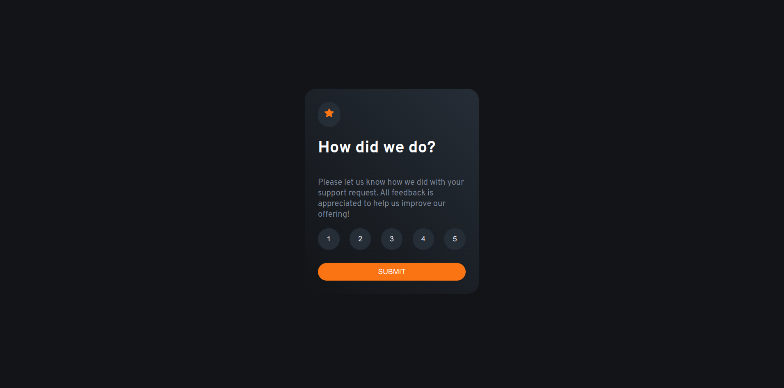
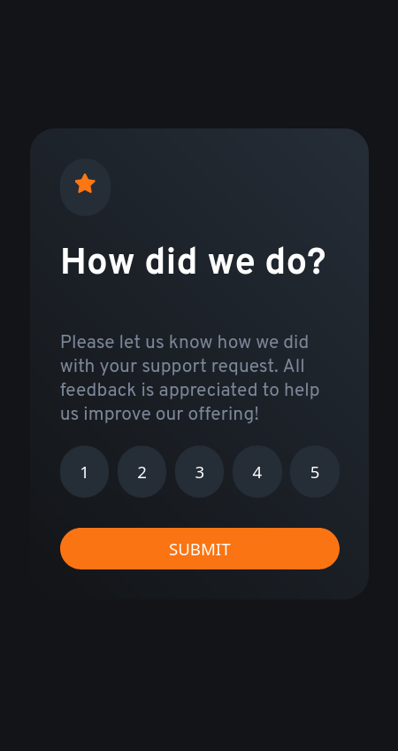

# Frontend Mentor - Interactive rating component solution

This is a solution to the [Interactive rating component challenge on Frontend Mentor](https://www.frontendmentor.io/challenges/interactive-rating-component-koxpeBUmI). Frontend Mentor challenges help you improve your coding skills by building realistic projects. 

## Table of contents

- [Frontend Mentor - Interactive rating component solution](#frontend-mentor---interactive-rating-component-solution)
  - [Table of contents](#table-of-contents)
  - [Overview](#overview)
    - [The challenge](#the-challenge)
    - [Screenshot](#screenshot)
      - [Desktop](#desktop)
      - [Mobile](#mobile)
    - [Links](#links)
    - [Built with](#built-with)
    - [What I learned](#what-i-learned)
    - [Continued development](#continued-development)
    - [Useful resources](#useful-resources)
  - [Author](#author)

**Note: Delete this note and update the table of contents based on what sections you keep.**

## Overview

### The challenge

Users should be able to:

- View the optimal layout for the app depending on their device's screen size
- See hover states for all interactive elements on the page
- Select and submit a number rating
- See the "Thank you" card state after submitting a rating

### Screenshot

#### Desktop 

[thank-you](./design/rating-desktop.png)

#### Mobile 

[thank-you](./design/rating-mobile.png)

### Links

- Solution URL: [github.com/PhilJG/react-interactive-rating-component)](https://github.com/PhilJG/react-interactive-rating-component)
- Live Site URL: [react-interactive-rating-component](https://guileless-gumdrop-2ef203.netlify.app/)


### Built with

- Semantic HTML5 markup
- CSS custom properties
- Flexbox
- Mobile-first workflow
- [React Hooks](https://reactjs.org/) 


### What I learned

This was my first project working with React hooks. 

To see how you can add code snippets, see below:

```js 
export default function NumberRating({rating, setRate}) {

  return (
      <RatingBtns setRate={setRate} rating={rating} />
  );
}

function RatingBtns({ rating, setRate }) {
  const ratings = [1, 2, 3, 4, 5];

  const ratingsItems = ratings.map((r) => (
    <button 
    //By providing a unique key prop to each button element, you are helping React to identify each element uniquely and optimize the rendering performance.
    key={r}
    className="ratings-selection" 
    //By wrapping the setRate function call inside an arrow function, to delay the execution of the function until the button is clicked and you are not directly updating the state of the App component while it is still rendering.
    onClick={() => setRate(r)}
    >
      {r}
    </button>
  ));

  return <div 
  className="ratings-selection-list">
    {ratingsItems}
    </div>;
}
```

### Continued development

More to learn in react and styling was less of a focus on this project though colorin came out funny and didn't line up with the mockups to begin with

### Useful resources

- [React Documentation](https://react.dev/) - The best way to learn react imo


## Author

- Website - [Phil J Gray](https://www.philjgray.ca)
- Frontend Mentor - [@PhilJG](https://www.frontendmentor.io/profile/PhilJG)
- LinkedIn - [Philip Gray](https://www.linkedin.com/in/phil-j-gray/)

